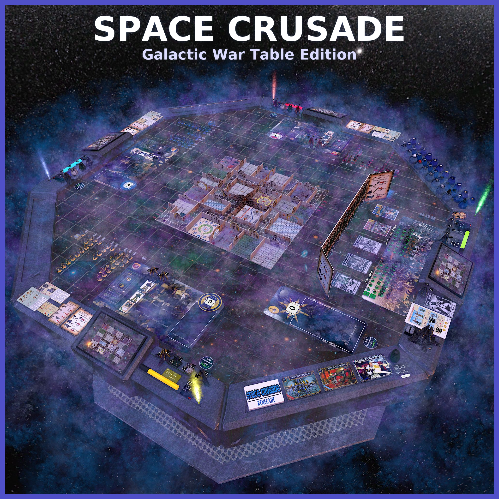

# Space Crusade: Galactic War Table Edition

Step into the grimdark universe of **Space Crusade**, now reimagined for **Tabletop Simulator**.  
Command squads of fearless **Space Marines** – choose from the stalwart **Blood Angels**, disciplined **Ultramarines**, or resilient **Imperial Fists** – and launch tactical assaults aboard an alien-infested **space hulk**.

Fierce creatures like **Orks**, **Genestealers**, **Chaos Marines**, and **Androids** stand in your way, while one player takes on the role of the alien adversary, thwarting the mission with cunning strategy and relentless pressure.

---

## ❓ Why Space Crusade?

**Space Crusade** is one of the best gateways into the **Warhammer 40k** universe.  
It was designed to be faster and more accessible than full-scale Warhammer while still capturing tactical depth, the grimdark setting, and iconic factions.

With streamlined rules, clear missions, and recognizable Space Marine chapters, it's an ideal introduction for players curious about Warhammer games but not yet ready to dive into the complexity of tabletop wargaming.

---

## 🎮 Game Features

- **Mission-based gameplay** – Faithfully recreates the modular board and dynamic scenarios of the original game.
- Includes both expansions: **Mission: Dreadnought** and **Eldar Attack**.
- Additional units from *White Dwarf* magazine – **Scouts**, **Terminators**, **Librarians**, and **Tyranids/Hybrids** for more tactical depth.
- **Three playmats** – Space Marines, Orks, and Eldars for varied thematic battles.
- Classic miniatures and components brought to life in digital form, enhancing tactical immersion and fast-paced gameplay.

Bring your campaign to life and relive the classic cooperative and strategic thrills.  
Are you ready to reclaim the hulk… or will the alien forces crush the crusade?

---

## 📖 Included Missions

All missions are **pre-setup** and stored in a **Memory Pod** for quick one-click placement:

- **12 base missions**
- **3 missions** from *Mission: Dreadnought*
- **4 missions** from *Eldar Attack*
- **5 missions** from *White Dwarf 145*
- **New Mission Kit** to easily create your own missions

---

## 🛠️ Tabletop Features

- **Move counters** to track unit distances
- **Camera display** for a mini-map on each player’s console
- **Counting bowl** to tally kill points

---

## 🌌 Looking for Players?

Join the community on **Discord**:  
👉 [https://discord.gg/urSK6m8zhU](https://discord.gg/urSK6m8zhU)

---

## 🙏 Credits and Thanks

Content adapted from the following workshop mods:

- [Space Crusade Complet [FR] by Groule](https://steamcommunity.com/sharedfiles/filedetails/?id=1314995431)
- [Space Crusade / StarQuest - English by Melon Pumpkinhead](https://steamcommunity.com/sharedfiles/filedetails/?id=1663035287)
- [Space Crusade Ultimate Table by pyokster](https://steamcommunity.com/sharedfiles/filedetails/?id=2387870445)
- [Utility Memory Bag by directsun](https://steamcommunity.com/sharedfiles/filedetails/?id=2057376256)
- [Angelic Deployment Bag by MoonkeyMod](https://steamcommunity.com/sharedfiles/filedetails/?id=2271387270)
- [Click Roller Universal by MrStump](https://steamcommunity.com/sharedfiles/filedetails/?id=1108731141)
- [Holo Table V.2 by Sonnolo](https://steamcommunity.com/sharedfiles/filedetails/?id=2042684905)
- [Epic Heresy: Knights and Titans by Gatorboii](https://steamcommunity.com/sharedfiles/filedetails/?id=3450207327)
- [Better Notebooks/Notepads by NightStorm](https://steamcommunity.com/sharedfiles/filedetails/?id=3138821727)
- [DnD Tools (Mini Injector) by ColColonCleaner](https://steamcommunity.com/sharedfiles/filedetails/?id=2454472719)
- [Fog & Steam Effects Animated by dashworth](https://steamcommunity.com/sharedfiles/filedetails/?id=2960728230)
- [Spell Pulses Effects Animated by dashworth](https://steamcommunity.com/sharedfiles/filedetails/?id=2960740403)
- [Lightsabers by ulia](https://steamcommunity.com/sharedfiles/filedetails/?id=935626975)
- [3D Modular Tiles, Rooms, Corridors etc by WalBanger -UK-](https://steamcommunity.com/sharedfiles/filedetails/?id=1932424773)
- [Counting Bowl by MrStump](https://steamcommunity.com/sharedfiles/filedetails/?id=946300090)
- [Dice Counter by Ockman](https://steamcommunity.com/sharedfiles/filedetails/?id=3551983119)
- [Lighting and Effects by Fenrys](https://steamcommunity.com/sharedfiles/filedetails/?id=1469725554)

Additional content from:

- [ESO Milky Way panorama](https://www.eso.org/public/images/eso0932a/)
- [Warhammer 40k Titan wallpaper](https://e1.pxfuel.com/desktop-wallpaper/92/802/desktop-wallpaper-warhammer-40k-war-hammer-titan.jpg)
- [Mission Landing Pad from Craiyon](https://www.craiyon.com/en/image/-uFz_3MxSvOyQky2ZaVSFA)
- [House & Solo Rules from Banjogames](https://banjogames.wordpress.com/category/boardgames/space-crusade/)

---

## 📚 Resources

- [Assets and savegame on GitHub](https://github.com/cornernote/tabletop_simulator-space_crusade)
- [Reddit: I rebuilt Space Crusade for Tabletop Simulator](https://www.reddit.com/r/SpaceCrusade/comments/1mzh5yg/i_rebuilt_space_crusade_for_tabletop_simulator/)
- [Reddit r/SpaceCrusade](https://www.reddit.com/r/SpaceCrusade/)
- [Game on Tabletop Simulator Steam Workshop](https://steamcommunity.com/sharedfiles/filedetails/?id=3545458420)

---

## ⚖️ Copyright & Attribution

This mod is based on the original **Space Crusade** board game, first published in 1990 as a collaboration between **Milton Bradley (MB UK)** and **Games Workshop**, designed by **Steven Baker**.

All intellectual property and trademarks belong to their respective rights holders.  
This digital adaptation is **non-commercial** and made with respect for the legacy and creativity of the original work.  
